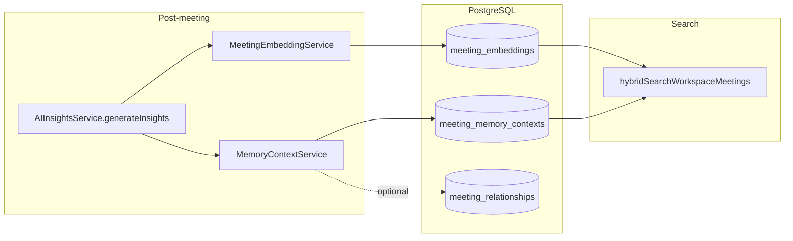

# Meeting Memory Engine — Technical Documentation

**What this is:** The Meeting Memory Engine stores **semantic representations** of meeting content in PostgreSQL using **pgvector**, runs **similarity and hybrid search** across a workspace, and maintains a **structured memory context** row per meeting. It powers Smart Search, memory context APIs, related-meeting style queries, and supplies text snippets that the **workspace knowledge graph** assembler can attach to meeting nodes.

**Embedding model:** `@xenova/transformers` with **all-MiniLM-L6-v2** — **384-dimensional** vectors (`EmbeddingService.js`). Speaker **voice-print** vectors (192-d ECAPA) live on user/workspace voice tables and are **not** stored in `meeting_embeddings`.

**Last updated:** April 24, 2026

---

## 1. Purpose

- Turn **transcript text** (chunked) and **AI-derived summaries** into vectors for retrieval.
- Persist **`meeting_memory_contexts`** with topics, decisions, action-item summaries, participants, prose context, and a **summary embedding**.
- Expose **authenticated HTTP APIs** under the workspace memory namespace for search, per-meeting context, related meetings, and (same router) graph endpoints that read overlapping tables.

---

## 2. Architecture

**Orchestration:** After insight agents run and insights are saved, `AIInsightsService` best-effort invokes `MeetingEmbeddingService.embedTranscript()` and `MeetingEmbeddingService.generateMemoryContext()`. Failures there **do not** fail the whole meeting completion pipeline.

**Reprocess:** `MeetingReprocessService` may call `MeetingEmbeddingService.regenerateMeetingEmbeddings(meetingId)` to refresh transcript rows plus **note** and **confirmed action-item** embedding rows after transcript or speaker cascade fixes.

**First-time completion nuance:** The default `generateInsights` path reliably embeds **transcript** and builds **memory context**. Embedding rows for **notes** and **confirmed action items** are written inside `regenerateMeetingEmbeddings`; that routine runs on **reprocess** (and similar maintenance paths). If product requirements need notes/action items in hybrid search immediately after every first completion without a reprocess, add a call to the note/action-item embed steps at the end of the normal insights path in code.

---

## 3. Data model (Prisma)

Authoritative field types: `backend/prisma/schema.prisma`.

| Model | Role |
|--------|------|
| **`MeetingEmbedding`** | Rows keyed by `meetingId`, `contentType` (`transcript`, `summary`, `note`, `action_item`, …), `content` text, optional `contentId`, `chunkIndex`, `metadata`, and `embedding` as **`vector(384)`**. |
| **`MeetingMemoryContext`** | One row per meeting: structured JSON arrays / text plus **`summaryEmbedding`** `vector(384)`, counts, timestamps. |
| **`MeetingRelationship`** | Optional explicit edges between meetings; may be sparse. Read APIs can compute similarity on demand when rows are missing. |

**Indexes:** HNSW indexes on vector columns are created in migrations (see `backend/prisma/migrations/` for `vector(384)` alterations and index rebuilds).

---

## 4. Services (backend)

### 4.1 `EmbeddingService.js`

Loads the MiniLM model (lazy singleton pattern as implemented). Exposes `generateEmbedding`, `generateBatchEmbeddings`, and chunking utilities used by `MeetingEmbeddingService`.

### 4.2 `MeetingEmbeddingService.js`

| Responsibility | Notes |
|----------------|--------|
| `chunkText` | Sentence-aware splitting for transcripts. |
| `embedTranscript(meetingId, text)` | Deletes existing transcript rows for the meeting, inserts chunked rows with vectors. |
| `embedSummary` | Summary-type row where used. |
| `embedMeetingNotes` / `embedConfirmedActionItems` | Used from `regenerateMeetingEmbeddings`. |
| `regenerateMeetingEmbeddings` | Reloads transcript from disk where possible, re-embeds notes and confirmed action items—intended for repair pipelines. |
| `generateMemoryContext` | Upserts `meeting_memory_contexts` from insight payloads with transcript fallbacks for summary text. |
| `searchWorkspaceMeetings` | Vector similarity over stored embeddings. |
| `hybridSearchWorkspaceMeetings` | Runs cosine similarity and PostgreSQL `plainto_tsquery` full-text in parallel, merges scores with a weighted blend (see in-file comments for weights). |
| `findRelatedMeetings` | Prefers `meeting_relationships` when populated; otherwise similarity on summary embedding. |

### 4.3 `MemoryContextService.js`

- `getMeetingContext(meetingId)` — meeting header fields, memory context columns, and a **short transcript snippet** from the first ascending `chunkIndex` transcript row in `meeting_embeddings`.
- `getRelatedMeetings(meetingId, limit)` — relationship rows or fallback similarity path.

### 4.4 HTTP surface

**Files:** `backend/src/routes/memoryRoutes.js`, `backend/src/controllers/memoryController.js`.

Under the authenticated workspace prefix (exact path prefix matches your Express mount, typically `/api/workspaces/:workspaceId/memory/...`):

- **Search** — semantic / hybrid query across the workspace.
- **`.../meetings/:meetingId/context`** — structured context + snippet for one meeting.
- **`.../meetings/:meetingId/related`** — related meetings list.
- **Graph** — `.../memory/graph`, `.../memory/graph/stats`, `.../memory/graph/node/:nodeId/neighbours` — implemented in the same router; graph responses are produced by **`MemoryGraphAssemblyService`**, which reads `meetings`, `meeting_memory_contexts`, tasks/action items, and `meeting_embeddings` for optional card text.

---

## 5. Hybrid search behaviour

1. Query string → embedding via `EmbeddingService`.
2. Vector search against `meeting_embeddings` (and related SQL as coded).
3. Full-text leg using `plainto_tsquery('english', ...)`.
4. Merge result lists with weighted scoring; return hits suitable for UI grouping by meeting.

The frontend **Smart Search** modal uses `matchedTerms` from the backend for `<mark>` highlighting in snippets.

---

## 6. Integration triggers

| When | What runs |
|------|-----------|
| Successful post-meeting `generateInsights` | Best-effort transcript embed + `generateMemoryContext`. |
| Meeting **reprocess** pipeline | May call `regenerateMeetingEmbeddings` for a full refresh. |
| Authenticated maintenance `POST` on meeting-scoped **regenerate-embeddings** route (if enabled in your deployment) | Triggers `regenerateMeetingEmbeddings` for ops-style repair. |

---

## 7. Operational notes

- **Idempotency:** Transcript embedding replaces prior transcript rows for the meeting to avoid unbounded duplicate chunks on repeated runs.
- **Cost model:** CPU/RAM bound (local model), not per-token cloud embedding billing.
- **Limits:** Graph assembly and search use explicit limits to protect latency and payload size.

---

## 8. Frontend consumers (non-exhaustive)

- `frontend/src/components/workspace/memory/` — memory page, graph canvas, filters, query bar.
- `frontend/src/hooks/useQueryMemory.ts` — semantic search for graph focus.
- `frontend/src/components/meetings/...` — Smart Search modal and any meeting surfaces calling memory APIs.

---

## 9. Glossary

- **Hybrid search:** Vector similarity plus keyword (FTS) merge.
- **Memory context:** The `meeting_memory_contexts` row summarising a meeting for retrieval and UI.
- **Chunk index:** Order of transcript segments for reconstruction and snippet selection.
