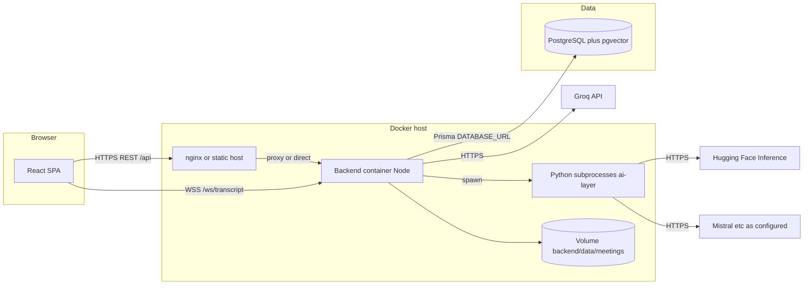

# Kairo — Docker deployment plan

This document maps how the **frontend**, **backend**, **database**, and **AI-related workloads** fit together in this repository, and gives a **step-by-step** path to run them with Docker. It is grounded in the current code layout (not a hypothetically split microservice).

---

## 1. What you are deploying (architecture)

### 1.1 Logical components

| Layer | Technology | Role |
|--------|------------|------|
| **Frontend** | React + Vite (`frontend/`) | SPA: REST calls, WebSockets for live transcript / action items |
| **Backend** | Node.js + Express (`backend/src/server.js`) | API (`/api/*`), WebSocket upgrade path `/ws/transcript`, Prisma ORM, meeting file I/O |
| **Database** | PostgreSQL + **pgvector** | Primary store; Prisma schema enables `vector` extension |
| **AI — insights agents** | Python under `ai-layer/agents/` | Invoked by the backend via **`child_process.spawn`** (not an HTTP service) |
| **AI — transcription** | Python WhisperX under `ai-layer/whisperX/` | Same pattern: subprocess from `TranscriptionService` |
| **AI — hosted LLM APIs** | Groq / Hugging Face Inference | Called **from Node** (e.g. memory chat, whisper-mode recaps) and **from Python** (agents use HF client with token env) |

### 1.2 How the backend “calls” AI today

There is **no separate AI microservice URL** in the codebase. The backend:

1. **Runs Python scripts on the same machine** as the Node process, using the repo paths:
   - `ai-layer/agents/run_agents.py` and related scripts (`AIInsightsService.js`, `AgentProcessingService.js`)
   - `ai-layer/whisperX/transcribe-whisper.py` (`TranscriptionService.js`)
2. **Passes secrets into the child process environment**, e.g. `MISTRAL_API_KEY` is set on spawned Python processes for agents (`AIInsightsService.js`).
3. **Calls Groq over HTTPS** directly from Node (`MeetingMemoryChatService.js`, `MicroSummaryService.js`) using `GROQ_API_KEY` / optional `GROQ_API_KEY_2`.

**Implication for Docker:** the practical default is a **combined backend image** (Node + Python + native deps) **or** a single container that mounts the repo and installs both stacks. Splitting “AI” into its own container would require **new HTTP/gRPC APIs and code changes**; this plan treats that as an optional later phase.

### 1.3 Data that must persist

- **PostgreSQL**: all structured data (Prisma).
- **Meeting files**: written under `backend/data/meetings/` (see `meetingFileStorage.js`, `MeetingBot.js`). This directory should be a **Docker volume** in production so uploads, audio chunks, and transcripts survive restarts.

### 1.4 Network interactions (runtime)



---

## 2. Target Docker topology

Recommended **first production-shaped layout**:

| Service | Image / build | Ports | Notes |
|---------|----------------|-------|--------|
| **db** | `pgvector/pgvector:pg16` (or similar) | `5432` internal only | Must match Prisma `postgresqlExtensions` + `vector` |
| **backend** | Custom Dockerfile (Node + Python + ffmpeg) | `5000` (internal); expose via reverse proxy | Contains `backend`, `ai-layer`, root `requirements.txt` context |
| **frontend** | Build stage → nginx serving `dist/` | `80` / `443` via proxy | Or host SPA on CDN; same-origin proxy simplifies WebSockets |

**Reverse proxy (recommended):** one entry host (e.g. Traefik or nginx) that:

- Serves the SPA.
- Proxies `/api` and WebSocket path `/ws/transcript` to the backend (WebSocket upgrade headers required).

That avoids mixed origins and simplifies cookies/CORS; the backend already uses `FRONTEND_URL` and an allowlist including `http://localhost:5173` in `server.js`.

---

## 3. Environment variables (what must be wired)

### 3.1 Backend / container env

The server loads dotenv from the **repository root** `.env` path as implemented in `backend/src/server.js` (`path.join(__dirname, '../../.env')`). In Docker, prefer **injecting env via Compose / orchestrator** rather than relying on a baked-in file.

**Critical**

| Variable | Purpose |
|----------|---------|
| `DATABASE_URL` | Prisma PostgreSQL URL (must include `?schema=public` etc. as needed) |
| `JWT_SECRET` | Auth token signing (`middleware/auth.js`, `authRoutes.js`) |
| `MISTRAL_API_KEY` | Passed to Python agents; HF client also reads this name (`hf_client.py`) |
| `GROQ_API_KEY` | Node → Groq for memory chat and micro-summaries (`GROQ_API_KEY_2` optional for rotation) |
| `FRONTEND_URL` | CORS + calendar OAuth redirects (`server.js`, `calendarController.js`) |

**Database (legacy pool in `config/db.js`)**

If anything still uses `pg` `Pool` with `DB_USER`, `DB_HOST`, `DB_NAME`, `DB_PASSWORD`, `DB_PORT`, set these consistently with `DATABASE_URL` or migrate callers to Prisma-only.

**Feature flags / integrations**

| Variable | Purpose |
|----------|---------|
| `ENABLE_CALENDAR_INTEGRATION` | `true` to mount `/api/calendar` |
| `GOOGLE_CLIENT_ID`, `GOOGLE_CLIENT_SECRET`, `GOOGLE_REDIRECT_URI` | Google OAuth; redirect must be **public backend URL** + `/api/calendar/oauth/google/callback` |
| `SUPABASE_URL`, `SUPABASE_SERVICE_ROLE_KEY` | If Supabase features are used |

**Operational**

| Variable | Purpose |
|----------|---------|
| `PORT` | Backend listen port (default `5000`) |
| `NODE_ENV` | `production` for hardened error responses |

**Bots / Whisper mode / tuning** (optional): `BOT_NAME`, `SHOW_BROWSER`, `WHISPER_MODE_*`, `MEMORY_CHAT_GROQ_*`, etc., as in existing `.env` patterns.

### 3.2 Hugging Face / WhisperX / pyannote

Diarization stacks often need **accepted model licenses** and sometimes a **Hugging Face token** for gated models. The Python helper `hf_client.py` accepts `HUGGINGFACE_API_TOKEN` / `HUGGING_FACE_TOKEN` / `MISTRAL_API_KEY`. Plan for:

- Storing a valid **`HUGGINGFACE_API_TOKEN`** (or equivalent) in the backend container env if inference or model download requires it.
- Pre-downloading models in the image or cache volume to avoid cold-start failures.

### 3.3 Frontend build-time configuration (gap to fix for real deploys)

Today several files assume **`http://localhost:5000`** (e.g. `frontend/src/services/api.ts`, parts of `CalendarStep.tsx`, `TranscriptPanel.tsx`, `useWhisperRecaps.ts`).

For Docker/production you should:

1. Introduce **`VITE_API_BASE_URL`** (and optionally **`VITE_WS_BASE_URL`**) and replace hardcoded URLs.
2. Build the frontend with e.g. `VITE_API_BASE_URL=https://your-domain.com/api` (note: no trailing slash mismatch with `/api` routes).

Until that change exists, you can still deploy by **same-origin reverse proxy** (`/api` → backend) and setting build to relative URLs (`''` or `/api`), which is the cleanest pattern.

---

## 4. Dockerfile strategy (backend)

Because Node **spawns** Python, the backend image should:

**Base:** e.g. `node:20-bookworm` + install `python3`, `python3-venv`, build tools, **ffmpeg** (system package; Node also bundles ffmpeg/ffprobe via npm but Whisper/audio tooling often expects CLI).

**Steps (conceptual):**

1. Copy `package.json` / lock for `backend` → `npm ci --omit=dev` (or include dev only if you build inside image).
2. Copy root `requirements.txt` → create venv → `pip install -r requirements.txt` (large; layer caching matters).
3. Copy `backend/`, `ai-layer/`, and Prisma schema.
4. Run `npx prisma generate` (needs `DATABASE_URL` only if you use migrate in CI; generate typically does not need live DB).
5. Set `WORKDIR` to `backend` or repo root and **`CMD`** `node src/server.js` (confirm entry: `server.js` lives under `backend/src/`).

**CPU vs GPU:** Current docs describe WhisperX on CPU (`int8`). GPU deployment would need NVIDIA runtime, CUDA-compatible PyTorch, and Compose device reservations — out of scope unless you change images.

**Meeting bot (Puppeteer):** `MeetingBot.js` uses headless Chrome. That requires Chromium dependencies in the image and is operationally heavy; for many deployments you disable bot features or run bots on a dedicated worker image.

---

## 5. Database initialization

1. Start PostgreSQL with **pgvector** (image such as `pgvector/pgvector`).
2. Create database and user; set `DATABASE_URL`.
3. From the backend container (or CI job with network access to DB):

   ```bash
   npx prisma migrate deploy
   ```

4. If your deployment uses non-default embedding dimensions, follow existing repo scripts/docs (e.g. vector column verification scripts under `backend/scripts`).

---

## 6. Step-by-step: complete deployment process

Use this as a checklist from zero to verified production.

### Phase A — Prerequisites

1. **Machine / cluster** with Docker (and optional Compose plugin).
2. **Secrets manager** or secure storage for API keys (`MISTRAL_API_KEY`, `GROQ_API_KEY`, `JWT_SECRET`, DB password, optional `HUGGINGFACE_API_TOKEN`).
3. **Domain + TLS** (Let’s Encrypt or provider certificate) for the public URL.
4. **Google Cloud console** (only if calendar enabled): OAuth client with redirect URI matching `GOOGLE_REDIRECT_URI`.

### Phase B — Repository readiness

1. Align **frontend config** with deployment URLs (env-based API/WebSocket bases — recommended code change).
2. Decide **meeting data volume** path (e.g. `/var/lib/kairo/meetings` → mount at `/app/backend/data/meetings` or equivalent inside container).
3. Freeze **Node and Python** versions in Dockerfiles for reproducible builds.

### Phase C — Build images

1. **Build frontend image** (multi-stage): `npm ci && npm run build` → copy `dist/` to nginx.
2. **Build backend image** as in section 4; tag e.g. `kairo-backend:VERSION`.
3. (Optional) Push images to your registry.

### Phase D — Compose / orchestration manifest

1. Define service **`db`**: pgvector image, persistent volume, strong password, no public port in production (internal network only).
2. Define service **`backend`**: env from secrets; mount **meetings volume**; depends_on `db`; expose `5000` only inside network unless debugging.
3. Define service **`frontend`** or **`proxy`**: nginx routes:
   - `/` → SPA static files
   - `/api` → `http://backend:5000/api`
   - `/ws/transcript` → same upstream with **WebSocket** support
4. Set `FRONTEND_URL` to the **public** SPA origin (scheme + host, no trailing path garbage).

### Phase E — First deploy

1. `docker compose up -d db` (wait healthy).
2. Run **migrations** (`prisma migrate deploy`) against `DATABASE_URL`.
3. `docker compose up -d backend frontend proxy`.
4. Hit `GET /` on backend or health route described in `server.js` (root returns JSON status).

### Phase F — Verification

1. **Auth:** register/login via SPA; confirm JWT works with same-site or CORS configuration.
2. **API:** create workspace/meeting flows against `/api`.
3. **WebSocket:** open a live meeting view; confirm `/ws/transcript?meetingId=...` connects through the proxy (wss in production).
4. **AI path:** trigger transcription + insights on a short test meeting; confirm:
   - Python subprocess starts (check logs).
   - `MISTRAL_API_KEY` / Groq errors do not appear (fix secrets if so).
5. **Persistence:** restart backend container; confirm `backend/data/meetings` still has files.

### Phase G — Hardening

1. Non-root user in containers where possible.
2. Resource limits (CPU/memory) on backend — WhisperX is easy to OOM without caps.
3. Log aggregation and rotation.
4. Backup strategy for Postgres + file volume.
5. Rate limiting / WAF on public proxy.

---

## 7. How the backend uses AI env at runtime (summary)

1. **Process env:** Node reads `MISTRAL_API_KEY`, `GROQ_API_KEY`, etc. from the container environment (or `.env` if mounted).
2. **Subprocess env:** When spawning Python, the backend explicitly forwards keys needed by agents (e.g. `MISTRAL_API_KEY` on agent runs in `AIInsightsService.js`). Other Python code may read `HUGGINGFACE_API_TOKEN` from the same inherited environment if you set it on the container.
3. **Outbound HTTPS:** Groq calls do not need a special “AI service host”; they need outbound internet and valid API keys.

No extra Docker service name (e.g. `http://ai:8080`) is required **unless** you refactor agents/transcription into a standalone API.

---

## 8. Optional future split (AI microservice)

If you later extract Python to a dedicated service:

- Define HTTP endpoints like `POST /v1/transcribe`, `POST /v1/agents/run-all`.
- Backend would call `AI_SERVICE_URL` instead of `spawn`.
- You would still need **shared storage** or object storage for audio/transcripts unless you stream huge payloads.

Document this only as a roadmap item; current code is **subprocess-first**.

---

## 9. Quick reference — port and paths

| Item | Value / location |
|------|------------------|
| Default API port | `5000` (`PORT` in `server.js`) |
| WebSocket path | `/ws/transcript` (`WebSocketServer.js`) |
| Prisma DB | `DATABASE_URL`, PostgreSQL + pgvector (`schema.prisma`) |
| Meeting files | `backend/data/meetings/` |
| Python AI code | `ai-layer/` |
| Root Python deps | `requirements.txt` |

---

*This plan reflects the repository layout and integration style at authoring time. When you add Dockerfiles or Compose files to the repo, link them here and keep env variable lists in sync with code.*
